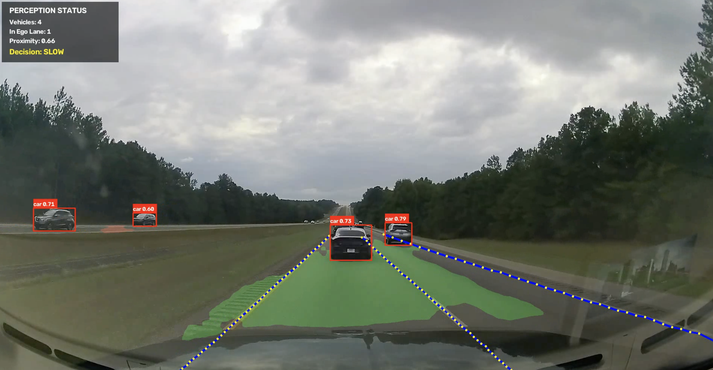

# 🚗 Autonomous Driving Perception System

A computer vision perception pipeline for autonomous driving, combining **object detection, road segmentation, lane detection, temporal stabilization, ego-lane analysis, and driving decision logic**.

The system processes road video frames and builds a unified understanding of the driving environment to determine whether the vehicle should:

**CLEAR → SLOW → STOP**

> This project focuses on the **perception and decision-support layer** of autonomous driving rather than vehicle control.

---



---
## 🎥 Demo

The system processes driving footage frame-by-frame and visualizes:

- Road and drivable-area segmentation
- Lane boundaries
- Detected vehicles
- Vehicles located inside the ego lane
- Relative vehicle proximity
- Driving decision: `CLEAR`, `SLOW`, or `STOP`

The final pipeline also exports the processed result as a video.

---

## 🧠 System Architecture

```text
                 Input Video
                      │
                      ▼
               ┌─────────────┐
               │ Video Frame │
               └──────┬──────┘
                      │
          ┌───────────┼───────────┐
          │           │           │
          ▼           ▼           ▼
      YOLOv11      SegFormer     UFLDv2
      Object         Road          Lane
     Detection    Segmentation   Detection
          │           │           │
          └───────────┼───────────┘
                      ▼
              Perception Fusion
                      │
                      ▼
            Temporal Lane Smoothing
                      │
                      ▼
              Ego-Lane Detection
                      │
                      ▼
        Vehicle-in-Lane Classification
                      │
                      ▼
          Relative Proximity Analysis
                      │
                      ▼
              Driving Decision
                      │
             ┌────────┼────────┐
             ▼        ▼        ▼
           CLEAR     SLOW      STOP
```

---

## 🔍 Perception Components

### 1. Object Detection — YOLOv11

YOLOv11 is used to detect objects in each video frame.

The pipeline extracts vehicle bounding boxes and passes detected cars to the driving-logic module.

Detected vehicles are then analyzed relative to the estimated ego lane.

---

### 2. Road Segmentation — SegFormer

The project uses:

`nvidia/segformer-b0-finetuned-cityscapes-1024-1024`

SegFormer performs semantic segmentation of the road scene.

Post-processing is applied to improve the road mask:

- Morphological opening
- Morphological closing
- Small connected-component removal
- Hood-region filtering

This produces a cleaner representation of the drivable road area.

---

### 3. Lane Detection — UFLDv2

Lane detection is performed using **Ultra-Fast-Lane-Detection-v2 (UFLDv2)**.

The CULane ResNet-18 configuration is used to estimate lane points across the road scene.

The original implementation was adapted to run on **Apple Silicon / MPS**.

---

## 🛣️ Temporal Lane Stabilization

Frame-by-frame lane predictions can fluctuate or temporarily disappear.

To improve video stability, the project implements temporal lane smoothing.

The stabilization system:

- Retains recently detected lanes for short prediction gaps
- Rejects large sudden lane jumps
- Smooths lane coordinates between consecutive frames
- Maintains lane information across short detection failures

This reduces visual lane flickering and creates more stable lane estimates.

---

## 🚘 Ego-Lane Reasoning

Instead of treating every detected vehicle as an obstacle, the system determines which vehicles are located inside the **ego vehicle's lane**.

The pipeline:

1. Finds lane boundaries around the image center
2. Estimates the ego lane
3. Calculates the bottom-center point of each detected vehicle
4. Compares the vehicle position with the left and right ego-lane boundaries
5. Keeps only vehicles located inside the ego lane

This prevents vehicles in neighboring lanes from unnecessarily affecting the driving decision.

---

## 📏 Relative Proximity

For vehicles inside the ego lane, the system calculates an image-space proximity estimate based on the vertical location of the vehicle bounding box.

```text
proximity = vehicle_bottom_y / image_height
```

A vehicle appearing lower in the image is treated as being relatively closer to the ego vehicle.

> This is a monocular image-space heuristic and does **not** represent metric distance in meters.

---

## 🚦 Driving Decision Logic

The final perception information is converted into a simple driving-state decision.

```text
No relevant vehicle ahead
        ↓
      CLEAR

Vehicle approaching
        ↓
       SLOW

Vehicle very close
        ↓
       STOP
```

The current thresholds are designed for experimentation and demonstration rather than safety-critical vehicle control.

---

## ⚡ Apple Silicon Optimization

The neural-network inference pipeline supports Apple Silicon acceleration using **PyTorch MPS**.

The project runs:

- SegFormer → MPS
- UFLDv2 → MPS
- YOLOv11 → MPS

with CPU fallback when hardware acceleration is unavailable.

This significantly improves video-processing performance compared with CPU-only inference on supported Macs.

---

## 📊 Perception HUD

The final visualization displays a live perception status panel containing:

```text
PERCEPTION STATUS

Vehicles:      detected vehicles
In Ego Lane:   relevant vehicles
Proximity:     relative proximity estimate
Decision:      CLEAR / SLOW / STOP
```

This makes it easier to understand how the perception pipeline interprets each scene.

---

## 🛠️ Technologies

- Python
- OpenCV
- PyTorch
- Torchvision
- Ultralytics YOLOv11
- NVIDIA SegFormer
- UFLDv2
- NumPy
- Hugging Face Transformers
- Apple Metal Performance Shaders (MPS)

---

## 📁 Project Structure

```text
self-driving-perception/
│
├── data/
│   └── test_images/
│
├── src/
│   ├── detection.py
│   ├── driving_logic.py
│   ├── lane.py
│   ├── preprocessing.py
│   └── segmentation.py
│
├── Ultra-Fast-Lane-Detection-v2/
│
├── main.py
├── video_main.py
├── .gitignore
└── README.md
```

Model weights and generated videos are excluded from Git tracking.

---

## ▶️ Running the Project

### 1. Clone the repository

```bash
git clone https://github.com/Meshal16/self-driving-perception.git
cd self-driving-perception
```

### 2. Create an environment

```bash
conda create -n self-driving python=3.11
conda activate self-driving
```

### 3. Install dependencies

```bash
pip install opencv-python
pip install torch torchvision
pip install ultralytics
pip install transformers
pip install tensorboard
```

### 4. Model Weights

The project requires the relevant YOLO and UFLDv2 model weights.

Model weight files (`.pt` and `.pth`) are intentionally excluded from the repository.

### 5. Configure the input video

Set the input path inside:

```text
video_main.py
```

Then run:

```bash
python video_main.py
```

The processed demo is exported to:

```text
output/final_perception_demo.mp4
```

---

## ⚠️ Current Limitations

This project is an experimental perception prototype and is **not intended for real-world vehicle control**.

Current limitations include:

- Monocular proximity is not metric depth estimation
- Lane performance depends on road geometry and camera viewpoint
- Driving decisions use simple rule-based thresholds
- No steering or vehicle actuation
- No sensor fusion with LiDAR, radar, GPS, or IMU
- Performance can vary under difficult lighting, weather, and road conditions

---

## 🚀 Future Improvements

Possible next steps include:

- Monocular depth estimation
- Vehicle tracking across frames
- Time-to-collision estimation
- Lane departure detection
- Traffic-sign and traffic-light recognition
- Improved drivable-area understanding
- Sensor fusion
- CARLA simulation integration
- Steering/path-planning experiments

---

## 🎯 Project Goal

The goal of this project was to move beyond isolated computer vision models and understand how multiple perception components can work together as a single autonomous-driving pipeline.

Rather than only detecting objects, the system combines:

**Detection + Segmentation + Lane Understanding + Temporal Reasoning + Decision Logic**

to build a more complete representation of the driving scene.

---

## 👤 Author

**Meshal Alsaqabi**

Software Engineering graduate interested in **Computer Vision, Deep Learning, and Autonomous Driving Systems**.